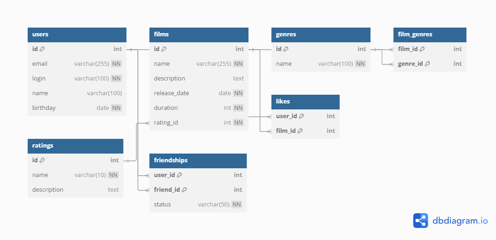

# java-filmorate
Template repository for the Filmorate project.

## Database Diagram

## Example Query

### Adding a New Film to the `films` Table

INSERT INTO films (name, description, release_date, duration)
VALUES ('The Lord of the Rings', 'A fantasy movie about the adventures of hobbits', '2001-12-19', 178);